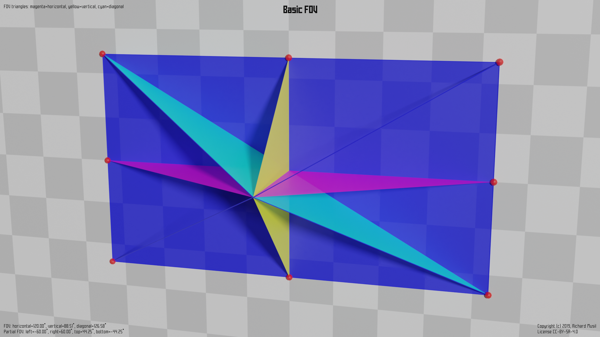
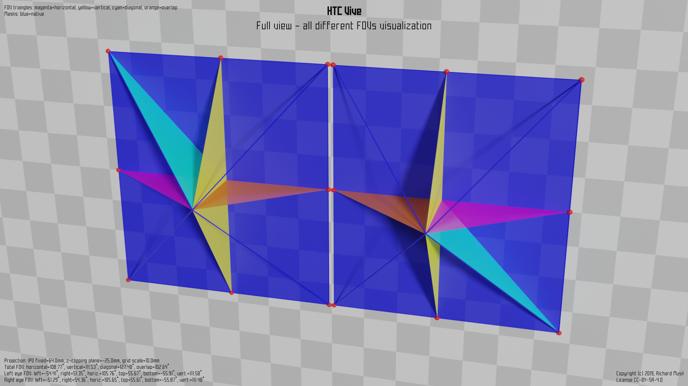
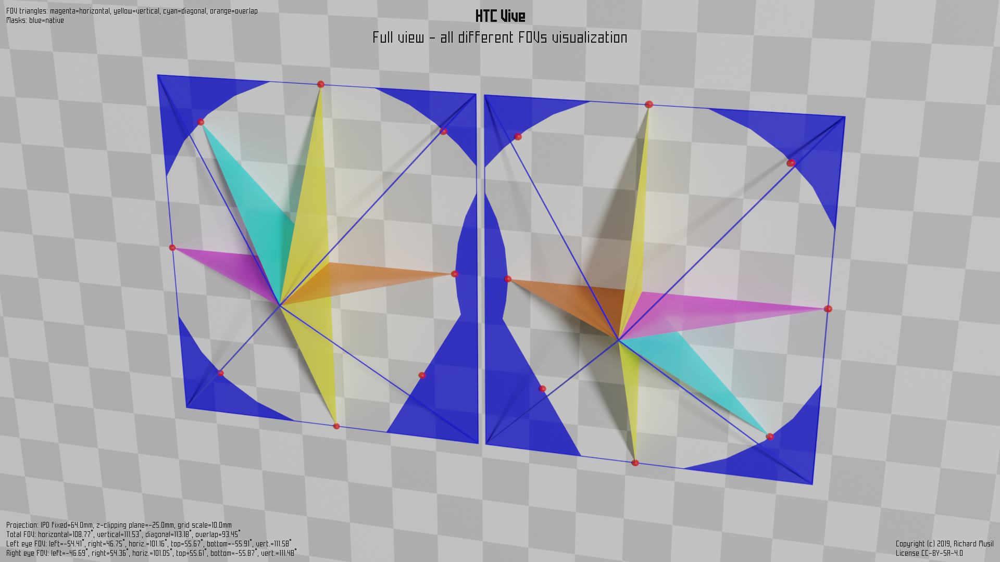
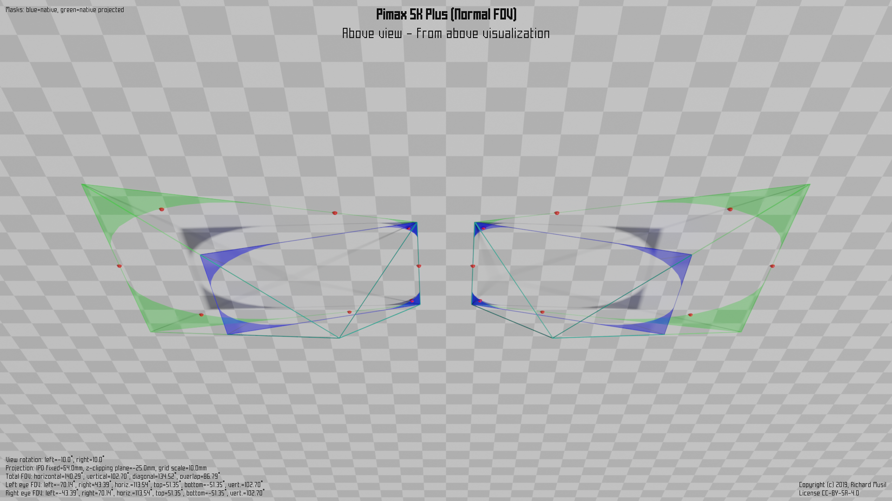
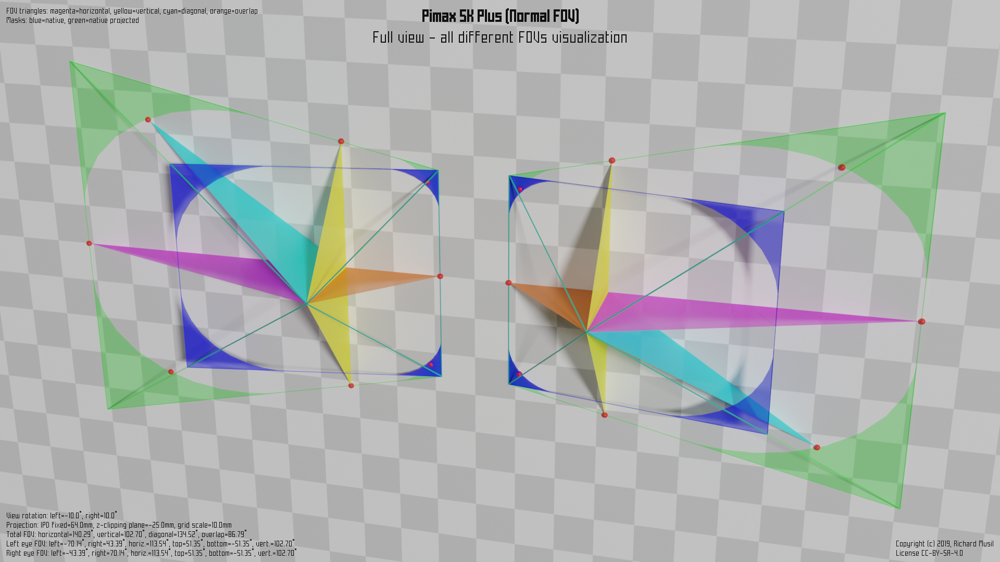
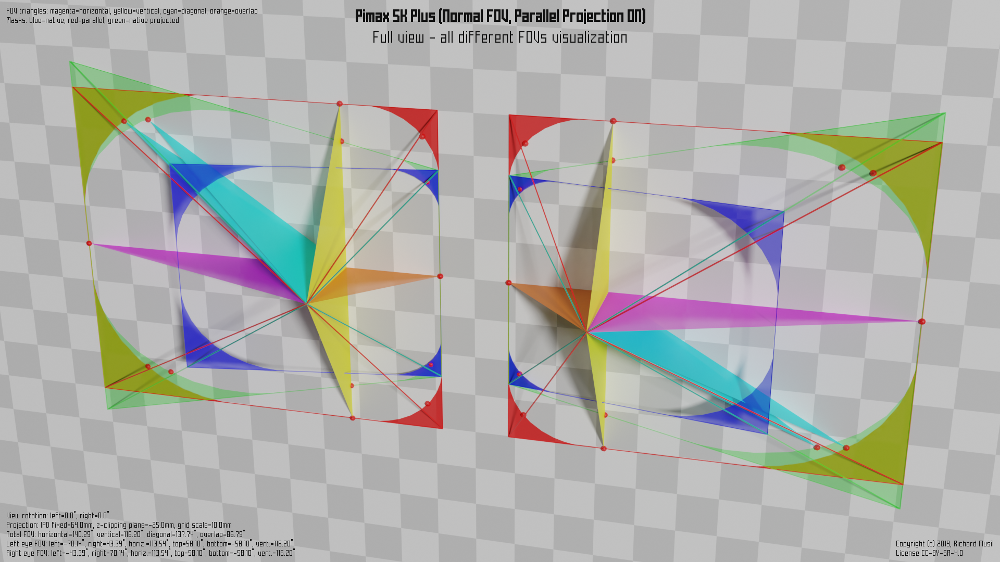

# VR headset rendered FOV calculation

## Basic theory

The idea about using angular dimensions to describe the field of view has been
there probably since the beginning of the 3D rendering, e.g. OpenGL. It was
then popularized by the first person shooters (read Quake), because there,
users could actually appreciate its significance.

Setting a large "FOV" in Quake, could get you a competitive advantage (and a
sick image), because you saw more than those who did not do it. What you
actually set there back then was the _visible horizontal angular range_.
Clearly it would not be a sufficient parameter to describe the natural field of
view of the human eye, as this is much more complex, depending on the face
anatomy, the optical acuity, etc. Luckily the 3D rendering technology works
with much simpler geometry - in fact it can only render into rectangular
frames.

Knowing the angular dimension in one direction and knowing the aspect ratio of
the rectangle gives automatically the other angular dimension. The horizontal
was probably chosen, because it seemed more important in daily life and so the
"FOV" in the computer (game) graphics was defined.

3D rendering pipeline uses _perspective projection_ which relies on
mathematical transformation of the objects from the 3D space into the 2D
computer display. This transformation is defined by the [_viewing
frustum_](https://en.wikipedia.org/wiki/Viewing_frustum).

The image below is a visualization of the angular dimensions in a mono view
(single eye) projection. The blue rectangle shows the shape (the aspect ratio
of the horizontal vs vertical dimension) of the viewing frustum's projection
plane, the intersecting colored triangles show the individual angular ranges,
the line perpendicular to the rectangle where all three triangles intersect, is
the view axis, and the eye is at the tip. View axis is always perpendicular to
the projection plane, or here to the "shape" plane.

[](./images/basic_fov.dmx.png)

The magenta triangle marks the horizontal FOV (the horizontal angular range),
the yellow triangle marks the vertical FOV (the vertical angular range) and the
cyan triangle marks the diagonal FOV. The exact values with which this image
was rendered were: 120.0° horizontal, 88.5° vertical and 126.6° diagonal. The
horizontal value and the aspect ratio (16:9) were chosen, the rest was
calculated. The red "clown noses" mark the terminal points of the angular
ranges (FOVs) in their respective directions. Let's call them _FOV points_ as
they will have some significance later.

### Immutable property of the rendered image

What is important to understand is that the image rendered at a particular FOV
does not necessarily need to be observed at this FOV. Imagine that the blue
plane in the picture was a TV, and the image on the screen was showing a scene
with 120° horizontal FOV. Then to perceive the image naturally (i.e. with the
objects in the correct places) one would have to have the eye exactly at the
pinnacle of all three triangles. Which means quite close.

But if you move further from the screen, you will still see the same picture,
with "120 degree content", but the angle at which you will observe it will be
much smaller (for example only 30 degrees), so the perspective will not match -
you will lose the _angular verity_. The objects will look deformed, especially
close to the edge of the screen.

To put it differently, if you want to observe the scene correctly with the
respect to the 3D properties of the objects in the scene, i.e. their sizes and
positions, you need to have also the viewing angles correct. This is only
possible from the precise spot, defined by the view geometry used for the
rendering.

The another consequence, probably even more important for the following
explanation, is that once the scene is rendered, it encompasses the exact
amount of angular range it was rendered for. Even if you choose to display it
on a larger or curved screen, or look at it from the closer distance, you would
not see more information (more FOV) than there was from the beginning.
Everything which was originally in the virtual 3D space inside the viewing
frustum pyramid is in the image, everything which was outside is not.

The viewing frustum and the way how the perspective projection works also
ensures that the visibility (i.e. whether the object is rendered into the image
or not) does not depend on the distance from the eye, only on the angle at
which the object is observed from the viewing axis. (For practical reasons
though, the engines do not render the objects beyond certain distance = far
clipping plane, nor closer than another distance = near clipping plane.)

## Stereo view

Having the theory for the mono view in place, we can move to the stereo view.
This is also not new. The stereo rendering has been there for ages, but only
with VR it really went into the mainstream.

In stereo rendering the scene is rendered from two different spots (eye
positions) and then somehow presented to the viewer. The rendering was not the
problem, but until now, the presentation was. Today, with a VR headset, we have
finally the technology to do it.

The following pictures shows the view geometry of the original HTC Vive (OG
Vive) headset. One point needs to be clarified first. The blue planes are not
the headset displays, because if they were, they would have to be too close to
the eyes. They are simply just "shape planes" (clipping the view), helping to
visualize the shape (cut) of the viewing frustum used for the scene rendering
at a particular distance from the eye.

[](./images/vive_native_no_ham_over.dmx.png)

The thing is, with a VR headset, we cannot look at the screens with the naked
eye because the exact viewing spot to preserve the angular verity is too close,
so the panels would have to be very small to fit around the face and also it
would be quite uncomfortable (even impossible) to focus at such short distance.

Therefore we use lenses to place the panels (optically) further away and also
to put their (virtual) focal distance even further, so instead, of focusing at
2 cm distance, the eye can focus at 1 m, where the virtual image is presented.

The optical tricks however are not really changing the fundamentals of how the
rendering and all the FOV theory works. The scene is just rendered into two
images, instead of one, while using two different viewing points and two
different viewing geometries, because, the individual viewing frustums for each
eye can be (and usually are) different. In the example given above the eyes are
ever slightly shifted closer to the nose.

The colored triangles mark the same characteristics as already described in the
mono view part above, apart from the orange one, which is new and will be
described later.

The magenta is showing the _total horizontal FOV_ of the stereo view (now
composed of two parts), the yellow triangles represent the _vertical FOV_ (here
the stereo aspect does not change anything) and the cyan is the _total diagonal
FOV_.

The new color - the orange - symbolizes the stereo overlap, introduced by the
stereo view. I.e. the horizontal angular range visible by both eyes. The
introduction of the stereo overlap marks another important point. The total
horizontal FOV, i.e. the maximal horizontal angular range which is visible is
combined value for both eyes. It means that there are some areas (at the edge
of the range) which are only visible by one eye or the other (while the other
one is obscured by the nose).

Putting it into a formal expression:

_Total horizontal FOV = Left eye's left view + Right eye's right view_  
_Stereo overlap = Left eye's right view + Right eye's left view_  
_Diagonal FOV = Left eye's top left view + Right eye's bottom right view (or
vice versa)_  
_Vertical FOV - remains unchanged_

> **The exact angles are collected from the headset (driver) by OpenVR and then
> advertised to the application via the API.**

Which means, it is the headset who defines the view geometry, which the
application then uses to render the image. It also means that the geometry
depends on the hardware design of the headset and its optical properties in
particular.

The actual numbers from HTC Vive would look like this:
```
Left eye FOV:                    Right eye FOV:
    left:       -54.41 deg           left:       -51.29 deg
    right:       51.35 deg           right:       54.36 deg
    bottom:     -55.91 deg           bottom:     -55.87 deg
    top:         55.67 deg           top:         55.61 deg
    horiz.:     105.76 deg           horiz.:     105.65 deg
    vert.:      111.58 deg           vert.:      111.48 deg

              Total FOV:
                  horizontal: 108.77 deg
                  vertical:   111.48 deg
                  diagonal:   127.48 deg
                  overlap:    102.64 deg
```

Now, I wrote _would_ for a reason, because in reality, they are different. Meet
the HAM.

## Hidden area mask (HAM)

Since the current rendering technologies only know how to render an image into
a rectangle and the lenses in a VR headset mostly come in circular shapes,
people realized that when used together, either some part of the lens field of
view remains unused (if the full rendered rectangle fits into the lens circular
FOV), or some part of the rectangular image gets obscured, if the circular FOV
of the lens fits into the rectangle completely.

Because the optics is more difficult to make than the software, the decision
was made to cover the full FOV of the lenses and simply mask the never seen
parts of the image in the rendering. The renderer still has to do some work,
but can save the effort (which is a precious commodity in VR) in the final step
of the rasterization, where it can avoid the masked pixels.

The hint comes in the form of the _Hidden area mask_ (HAM), which is a simple
mesh, covering some part(s) of the original rendering rectangle. Its shape is
completely dependent on the lens design and differs from one headset to
another.

This is how it looks on HTC Vive:

[](./images/vive_native_ham_over.dmx.png)

Here the blue color mesh shows the HAM and the visible part is actually the
hole in it. The triangles symbolizing the individual FOVs are adapted to
measure only the visible area.

And the corresponding numbers:
```
Left eye FOV:                    Right eye FOV:
    left:       -54.41 deg           left:       -46.69 deg
    right:       46.75 deg           right:       54.36 deg
    bottom:     -55.91 deg           bottom:     -55.87 deg
    top:         55.67 deg           top:         55.61 deg
    horiz.:     101.16 deg           horiz.:     101.05 deg
    vert.:      111.58 deg           vert.:      111.48 deg

              Total FOV:
                  horizontal: 108.77 deg
                  vertical:   111.48 deg
                  diagonal:   113.18 deg
                  overlap:     93.45 deg
```
What suffers most from the HAM is the diagonal FOV (obviously), but the strange
shape close to the nose has also some impact on the stereo overlap. On the
other hand, the vertical FOV remains the same, and the total horizontal FOV as
well.

## Canted screens and views

So far all the theory behind the stereo view assumed that the two views were
oriented in the same direction, i.e. they were parallel to each other.
Consequently the projection planes were coplanar and parallel to the face of
the viewer. This concept was used in the stereo rendering for a long time.

VR changed the situation. It is more difficult to achieve a wide horizontal FOV
with parallel views than, say, canted views, because the horizontal dimension
of the panels (the width) increases with the _arcus tangent_ of the horizontal
angle (the magenta one in the pictures).

The idea is that by turning the displays slightly outwards, one can achieve
larger horizontal coverage while saving on the panel size, and therefore also
spending less effort on the rendering. It would come at the cost of a decreased
stereo overlap, but this may look like an acceptable trade-off. There is
nothing substantially different in rendering two non-parallel views from the
previous case. At least in theory. You just set up the two viewing frustums
looking "non-parallel", but apart from that, the process itself is basically
the same.

### Pimax 5k+ and 8k

The first consumer headsets which introduced the idea in the flesh were Pimax
5k+ and 8k models. This is how the non-parallel projection is implemented on
Pimax 5k+ in Normal FOV (~140° horizontally).

First the "plain" visualization without any FOV triangles to show the canting:

[](./images/p5k_normal_native_above.dmx.png)

and then the full picture:

[](./images/p5k_normal_native_over.dmx.png)

The HAM and the colored triangles for the different FOVs have been already
described above. What is new is the green area, which is the projection of the
blue shape into the parallel plane (with the face).

The blue area has the same meaning as in the previous example, i.e. it
represents the (rectangular) shape cut of the viewing frustum, or, if you want,
the space into which the renderer fits the image. It is just canted 10°
outwards.

The general formulas to calculate all the different FOVs are still the same as
in the Vive's case, just the values are different, and one needs to take the
panel rotation into account, when dealing with raw numbers.

One thing to point out though. The green area's (trapezoid) shape means that
the vertical viewing range, observed in the plane parallel to the face, is not
constant when moving from the nose to the outer edge. Because of that the
vertical FOV is defined as a vertical range observed when the both views are
parallel (i.e. the eyes are looking in the same direction, straight ahead). The
corresponding FOV points reflect that in the illustration.

All the figures would be fine if all the headsets were honest about their
geometry and did not cheat. They mostly do not (and for their defense, if they
do, it is not because they want to), but some do, and some do even more.
Welcome to the world of parallel projection.

## Parallel projection

Both the blue and the green "holes", i.e. what is not actually colored inside
the colored shapes in the previous picture, cover the exactly same field of
view. The only difference is that the shape of the blue one has the rectangular
form (good for the rendering engines), while the green one is a trapezoid, not
particularly appealing to the rendering. In fact, the only way to render into
such a shape is to render into a superior rectangle and mask all the surface,
which is not used.

The implication is that if someone would want to use (for some technical
reason) the green shape to cover the same FOV as the blue shape, he will
inevitably waste some resources. Even if the pixels are masked, the geometry
still needs to be processed.

In order to not lose precision in the transformation from the green shape to
the blue shape, some overhead (supersampling) is also needed.

Since it does not seem to look like a good idea, the question is, why would
anyone want to do that? The answer is simple. They have no choice.
Unfortunately, there is still a lot of VR applications, which were developed
with an (unsupported) assumption that the stereo rendering always happened into
parallel views and went a long way to optimize their code around this
assumption.

Even Nvidia's first hardware support for the stereo view rendering only worked
on parallel views. Before Pimax, the world was only parallel. Now, the demand
for the non-parallel rendering already reached the developers and the hardware
designers, but there is still a lot of work to do. And some applications are
simply stuck with their implementation for ever.

So to accommodate all those unfortunate cases, the _parallel projection mode_
was introduced. In this mode the headset behaves as if it has the parallel view
geometry and pretends to the VR subsystem that all is right and shiny, while
doing some nasty tricks afterwards, to put those parallel images onto its
non-parallel screens.

The following picture illustrates how things get messy in this mode. (Courtesy
of Pimax 5k+, Normal FOV, PP mode off (blue and green) and PP mode on (red)):

[](./images/p5k_normal_pp_over.dmx.png)

First you may notice that in order to keep the rendering overhead on the
manageable level, the red rectangle (which is the shape of the "pretended"
parallel stereo view the headset supports) does not completely cover the green
one. The outer green corner tips are cut off. Fortunately this is not a problem
as they are already in the masked area (the green surface is the projection of
the blue masked area).

The problem however appears at the inner parts of the views, where the red
shape not only fairly surpasses the green outline, but Pimax did not even
bother to define correctly the HAM for the parallel projection (red) rectangle,
so everything rendered into the "red hole" outside of the green outline is
wasted.

In fact, to further optimize the performance requirements, they could make the
red rectangle vertically smaller to match the non-masked green area height and
then mask the rest by the HAM.

The other unpleasant consequence of this mode is that it messes up the
calculation of the vertical FOV, because the one reported by the headset is a
false one. If you check the position of corresponding FOV points for both the
green and the red vertical FOVs, you may notice that they do not align (as well
as those for the diagonal).

And the last, but not least, effect is that it introduces a different
perceivable pixel density at the inner and the outer border of the single eye
view.

This also means:

> **If you use `hmdq` to calculate the vertical FOV of the headset, do not run
> it when the headset is in the parallel mode.**

If you do, you can get incorrect (bigger) values.

### Valve Index

Valve Index is another headset which uses canted displays and the parallel
projection.

While Pimax definitely has its issues with the parallel mode, they, at least,
give a clear indication that the parallel mode is on and offer some user
interface to control this feature.

Valve, on the other hand, decided that the best thing will be to turn this on
by default on everyone and do not indicate anything. So, if you are using the
Index and your are not sure, whether you have this feature enabled, you most
likely have.

If you want to make sure, you can check it by running `hmdq` and see `View
geometry` section in its output. If it says:
```
View geometry:
    left panel rotation:     0.0 deg
    right panel rotation:    0.0 deg
```
then you are using the headset in the parallel projection mode.

## Rendered FOV versus the visible one

Finally, all the calculations described above, in particular the calculation of
the _FOV points_ and subsequent _rendered FOVs_ can be performed by the command
line tool [`hmdq`](https://github.com/risa2000/hmdq) which queries the headset
over OpenVR API (the same way as any other VR application does), collects all
the necessary data advertised by the headset, and does the math.

The important aspect of this calculation is that it gives reproducible and
measurable results, independent of all the variable aspects, which otherwise
also influence what the user actually _can see_ in the headset. Among those
variable aspects are: the face shape, the eye depth, the distance from the eyes
(facepad thickness), the field of view of the lenses, interpupillary distance
(IPD), etc.

The FOVs described in this article are technical conditions at which the
headset operates and at which the application renders the scenes. The user
cannot see "more", because "more" is not rendered by the application. The user
can however see less, depending on how all the individual aspects named above
impact the whole optical path from the panels to the eyes.
